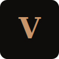

# VELOUR — Maison De Parfum



VELOUR is a high-end luxury niche perfumery showcase built with Astro, React Three Fiber, and a 100% custom-written WebGL shader architecture.

## 🏛️ Architecture Overview

The core feature of this landing page is the continuous, scroll-driven 3D cinematic scene (`CinematicScene.jsx`) that runs perfectly seamlessly beneath the Astro static HTML elements.

### The "Obsidian Glass" Hardware-Agnostic Engine

Previous iterations relied on standard Three.js physically-based rendering (PBR) materials like `MeshPhysicalMaterial`, `MeshTransmissionMaterial`, and procedural `Environment` Maps (HDRI cubemaps generated via `Lightformer`). 

While these produced beautiful glass refractions, they critically relied on **Frame Buffer Objects (FBOs)**. On strictly sandboxed browsers (e.g., Brave, Firefox with strict tracking prevention) or Linux/GPU-restricted environments, these FBOs would fail to compile, resulting in the 3D bottle rendering as a solid, flat white block.

**The Solution:**
We completely discarded PBR and Environment Maps. The bottle's luxurious "Smoked Glass" appearance is now generated by a **100% custom `ShaderMaterial`**.

1. **Fresnel Edge Glow**: Calculated via `dot(normal, viewDirection)` in the vertex shader to create the illuminated rim associated with thick glass.
2. **Procedural Vertical Gradients**: Instead of reflecting a 3D environment, the shader mathematically mixes colors based on world-space Y coordinates to simulate studio lighting gradients.
3. **Simulated Specular Highlights**: Fake specular reflections are injected directly into the fragment shader using Blinn-Phong math (`pow(max(dot(vNormal, halfDir), 0.0), shininess)`), ensuring a highly polished look without any computational overhead from real lights.
4. **Synesthesia Reactivity**: The shader uniforms (`uGlowColorTop`) are dynamically bound to Nano Stores. When a user interacts with the UI (e.g., clicking the "Scent Anatomy" section), the shader seamlessly morphs its internal gradient color.

This guarantees 100% cross-platform compatibility. If the device can run basic WebGL, it will render the luxury glass perfectly.

## 🛠️ Development & Build

### Prerequisites
Astro 6+ requires Node.js `22.12.0` or higher.
If you use NVM, simply run:
```bash
nvm use
```

### Scripts

- `npm run dev`: Starts the local Astro development server with Vite HMR.
- `npm run build`: Compiles the React components and Astro templates into a highly optimized static bundle in the `dist/` directory.
- `./verify-build.sh`: A custom script that loads the correct Node.js version via NVM, executes the production build, and verifies that the output artifacts exist.

## 🎭 State Management
The application bridges the React Three Fiber (Canvas) context and the Astro (HTML) context using **Nano Stores** (`synesthesiaStore.js`). This allows HTML buttons outside the Canvas to drive 3D animations and material uniform updates smoothly.
